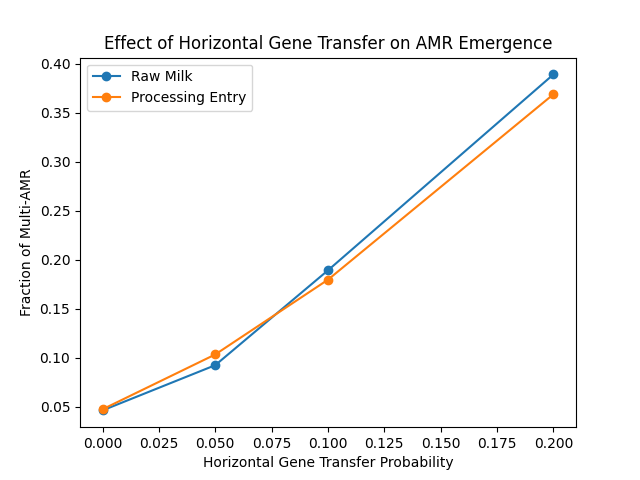
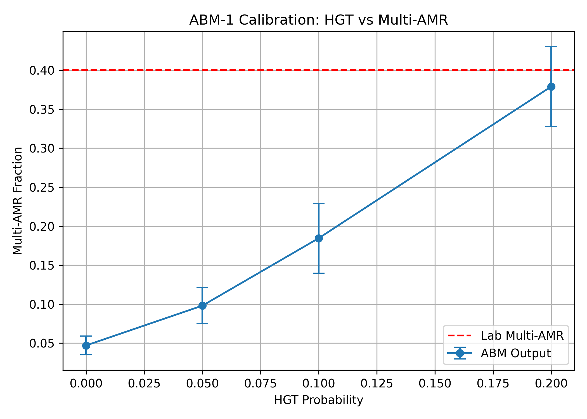
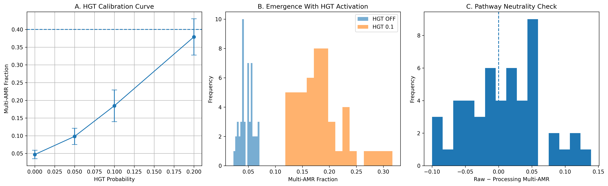

# Milk Supply Chain AMR Emergence Model

Authors: [Muhammad Tulat Fiaz](https://github.com/TalatFiaz454) and [Furqan Awan](https://github.com/furqan915)

Supervisor: [Furqan Awan](https://github.com/furqan915)

An agent-based model (ABM) simulating the emergence of antimicrobial resistance (AMR) through horizontal gene transfer (HGT) during milk aggregation, transport, and storage.

## Model Workflow

Farm → Transport → Storage → Raw milk supply or Processing entry

During the transport stage, milk batch agents interact within a mixing pool and may acquire additional AMR genes through horizontal gene transfer. Bacterial loads increase during transport and storage, followed by branching into raw-milk supply or processing entry.

## Model Parameters

The model represents 30 farms with 6 milk batches per farm, giving 180 milk-batch agents in the main experiment.

Key parameters used in the main HGT experiment include:

* Initial bacterial load: 10³–10⁴
* Initial AMR genes: 0, 1, or 2; high-AMR farms may start with 2 or 3
* High-AMR farms: 10%
* Growth rate: 0.4 per simulation step
* Raw-milk pathway fraction: 0.5
* HGT density threshold: 5 × 10⁵
* HGT probability: 0, 0.05, 0.10, and 0.20

HGT occurs during the transport stage. The effective HGT probability depends on the specified HGT probability and the combined bacterial load of interacting milk batches.

## Main HGT Experiment

The HGT probability was evaluated at 0, 0.05, 0.10, and 0.20.

For each HGT probability, 50 simulation runs were performed using different random seeds. Each simulation was run for 3 time steps.

The model outputs include:

* Fraction of multi-AMR batches (>2 AMR genes)
* Mean number of AMR genes
* Number of batches
* Results for raw-milk supply and processing-entry pathways

## Files

### `agents.py`

Defines the milk batch agents, including bacterial growth, AMR gene states, HGT interactions, and movement through the milk supply chain.

### `model.py`

Defines the ABM-1 model structure, simulation parameters, initialization of milk batches, transport-stage mixing, and model outputs.

### `run.py`

Runs a single demonstration simulation and prints the model outputs for the raw-milk and processing-entry pathways.

### `multi_run.py`

Runs the HGT probability experiment across 50 simulations for each HGT probability and saves the results as CSV files.

### `plot_hgt_calibration.py`

Generates the HGT calibration, HGT distribution, and pathway-neutrality figures.

### `plot_ABM1_multi_panel_figure.py`

Generates the combined three-panel validation figure.

### `requirements.txt`

Lists the Python packages required to run the model and analysis scripts.

## Figures

### Figure 1 — Horizontal Gene Transfer Probability

### HGT Calibration

### Multi-Panel Validation

## Results and Data

The simulation results from the HGT probability experiment are provided in the `results/` directory.

* `ABM1_HGT_Sweep_Summary.csv` — Summary statistics for each HGT probability.
* `ABM1_HGT_Sweep_AllRuns.csv` — Results from all individual simulation runs.

## Reproducibility

The complete model code, analysis scripts, figures, and simulation results used for ABM-1 are provided in this repository to support reproducibility of the reported analysis.

The software release is also archived in Zenodo.

## Citation

If you use this model or code in your research, please cite the associated research paper and software release.

Fiaz, M.T., M.H. Mushtaq, F. Awan and A. Riaz (2026). Detection of Multidrug-Resistant Milk-Associated Psychrotrophic Pseudomonas spp. Using Lab-Based and Agent-Based Modeling Approaches in Pakistan. J. Anim. Plant Sci.

Fiaz, M.T. and F. Awan (2026). Milk Supply Chain AMR Emergence Model (Version v1.0.0). Zenodo. DOI: 10.5281/zenodo.22773612

The paper DOI will be added after publication.

## Authors and Supervision

- [Muhammad Tulat Fiaz](https://github.com/TalatFiaz454) — Student researcher; data collection, analysis, organization, and documentation
- [Furqan Awan](https://github.com/furqan915) — Academic supervisor; model development and implementation

## Code Use and Attribution

If you use, modify, or build upon this code, please acknowledge the original work and cite the associated research paper and software release.

Please do not present this code, model, or substantial parts of it as your own original work.

## License

This project is released under the MIT License.

